# Laporan Proyek *Machine Learning* - Ridopandi Sinaga

# Domain Proyek

Bob telah memulai perusahaan selulernya sendiri. Karena baru memulai otomatis *Brand Name* dan *Social factors* dari hasil perusahaan selulernya dimata banyak orang belum kelihatan. Sehingga akan mempengaruhi konsumsi pasar akan produknya[[1]](https://core.ac.uk/download/pdf/234693783.pdf). Dia ingin berjuang keras supaya perusahaannya tidak tersingkir oleh perusahaan besar seperti Apple, Samsung dll.

Dalam beberapa kasus, perusahaan besar mungkin memasang harga yang tinggi untuk produk mereka berdasarkan merek dan citra mereka [[2]](https://www.ajhssr.com/wp-content/uploads/2020/08/V2048209214.pdf). Memanfaatkan hal ini dengan menawarkan produk yang memiliki fitur serupa dengan harga yang lebih terjangkau, Bob dapat mencuri sebagian pangsa pasar dan menarik pelanggan yang mencari alternatif yang lebih ekonomis. Ini memberikan Bob keuntungan kompetitif dalam meraih pelanggan yang ingin mendapatkan ponsel dengan fitur yang sama tetapi dengan harga yang lebih rendah.

Masalahnya Bob sekalipun tidak tahu bagaimana memperkirakan jangkauan harga bagi produk ponselnya yang beragam. Di pasar ponsel yang kompetitif ini, ia tidak bisa begitu saja berasumsi. Untuk mengatasi masalah ini, ia pun mengumpulkan data penjualan ponsel dari berbagai perusahaan. Bob ingin mengetahui hubungan antara fitur-fitur ponsel (misalnya: - *RAM, Memori Internal, camera*, dan lainnya) terhadap harga jualnya. Apakah memang benar semua fitur-fitur secara signifikan dapat mempengaruhi harga sebuah *smartphone* atau hanya sebagian fitur tertentu saja. Jika memang benar demikian, menentukan kisaran harga yang bagus untuk produk baru sesuai fiturnya dapat membantu Bob bersaing dengan perusahaan-perusahaan besar ini.

Namun muncul masalah baru, berdasarkan data yang banyak tersebut Bob tidak dapat menganalisanya begitu saja dengan mudah. Bob membutuhkan suatu model atau aplikasi yang dapat menganalisis data-data yang dia kumpulkan. Maka di dalam proyek ini akan dibuat sebuah model *machine learning* untuk melakukan analisis terhadap datanya. Dengan adanya model *machine learning* yang telah dibangun, diharapkan dapat membantu Bob dalam memperkirakan harga ponsel yang akan ia jual.

# Business Understanding

## Problem Statements

Berdasarkan latar belakang yang telah dijelaskan di atas, maka diperoleh rumusan masalah yang akan diselesaikan pada proyek ini, yaitu:

- Apa algoritma yang tepat untuk mengklasifikasikan rentang harga ponsel juga metrik evaluasi yang digunakan?

## Goals

Berdasarkan rumusan masalah yang telah dipaparkan di atas, maka didapatkan tujuan dari proyek ini, yaitu:

- Mengembangkan model *machine learning* yang dapat membagi kisaran harga jual ponsel dengan tingkat akurasi diatas 80%.

## Solution statements

 Terdapat beberapa jenis algoritma sebagai solusi yang akan coba dilakukan untuk dapat mencapai tujuan dari proyek ini, yaitu:

1) Decision Tree
2) Random Forest classifier
3) Gradient Boosting Classifier
4) K-nearest Neighbour classifier
5) XG Boost Classifier
6) Support Vector Machine(SVM)

 
Dalam membangun model berikut beberapa jenis algoritma yang dipakai.

- **Decision Tree**

   Decision tree bekerja dengan membagi dataset berdasarkan aturan-aturan pada pohon keputusan. Aturan-aturan ini menggabungkan informasi dari fitur-fitur pada data untuk memprediksi kelas atau label yang sesuai. Setiap simpul dalam pohon keputusan mewakili aturan yang membagi data menjadi subset yang lebih kecil. Proses ini berlanjut hingga mencapai daun-daun yang mewakili kelas prediksi. Saat melakukan prediksi, data baru akan melewati pohon keputusan, mengikuti aturan-aturan pada setiap simpul, hingga mencapai daun yang memberikan prediksi kelas.[[1]](https://www.cis.upenn.edu/~danroth/Teaching/CS446-17/LectureNotesNew/dtree/main.pdf)

  - Kelebihan:
    - Mudah dipahami dan diinterpretasikan.
    - Mampu menangani data kategorikal dan numerikal.
    - Tidak memerlukan pra pemrosesan data yang rumit.
    - Bekerja baik dengan dataset yang besar.
  - Kekurangan:
    - Cenderung overfitting jika tidak diatur dengan baik.
    - Tidak mampu menangani hubungan yang kompleks antara fitur.

          

- **K-Nearest Neighbor**
     K-Nearest Neighbor atau KNN adalah algoritma yang relatif sederhana dibandingkan dengan algoritma lain. Algoritma KNN menggunakan kesamaan fitur untuk memprediksi nilai dari setiap data yang baru. Dengan kata lain, setiap data baru diberi nilai berdasarkan seberapa mirip titik tersebut dalam set pelatihan. KNN bekerja dengan membandingkan jarak satu sampel ke sampel pelatihan lain dengan memilih sejumlah k-tetangga terdekat. KNN bisa digunakan untuk kasus klasifikasi dan regresi [[1](https://towardsdatascience.com/getting-acquainted-with-k-nearest-neighbors-ba0a9ecf354f)]. Cara kerja algoritma KNN adalah sebagai berikut [[2](https://towardsdatascience.com/machine-learning-basics-with-the-k-nearest-neighbors-algorithm-6a6e71d01761)]:

  - Inisialisasi nilai K (jumlah tetangga)
  - Hitung jarak antara data baru yang ditanyakan dengan seluruh sampel data pelatihan
  - Urutkan seluruh jarak berdasarkan jarak minimum dan tetapkan jumlah tetangga (nearest neighbors) sesuai dengan nilai K
  - Pilih sejumlah K data dengan jarak terdekat
  - Kemudian tentukan kelas atau label dari data baru

      

    Kelebihan dan kekurangan algoritma K-Nearest Neighbor adalah sebagai berikut:

  - Kelebihan:
    - Sederhana dan mudah diimplementasikan.
    - Tidak memerlukan proses pembelajaran yang kompleks.
    - Cocok untuk data dengan cluster atau pola sederhana.
  - Kekurangan:
    - Sensitif terhadap pemilihan parameter k.
    - Rentan terhadap outliers.
    - Membutuhkan memori yang lebih besar karena menyimpan semua data pelatihan.

    

- **XGBoost Algorithm**
      XGboost adalah algoritma yang merupakan implementasi lanjutan dari algoritma peningkatan gradien (Gradient Boosting). XGboost menggunakan prinsip ensemble yaitu menggabungkan beberapa set pembelajar (tree) yang lemah menjadi sebuah model yang kuat sehinga menghasilkan prediksi yang kuat. Kelebihan dari algoritma XGBoost adalah sebagai berikut  [[3](https://towardsdatascience.com/https-medium-com-vishalmorde-xgboost-algorithm-long-she-may-rein-edd9f99be63d)] :

  - Kelebihan:
    - Menghasilkan model yang sangat akurat.
    - Mampu menangani berbagai jenis fitur dan skala data.
    - Dapat menangani data yang tidak seimbang.

  - Kekurangan:
    - Rentan terhadap overfitting jika tidak diatur dengan baik.
    - Membutuhkan waktu komputasi yang lebih lama.

 

- **Random Forest**
      Random Forest (RF) adalah suatu algoritma yang digunakan pada klasifikasi data dalam jumlah yang besar. Klasifikasi random forest dilakukan melalui penggabungan pohon (tree) dengan melakukan training pada sampel data yang dimiliki. Penggunaan pohon (tree) yang semakin banyak akan mempengaruhi akurasi yang akan didapatkan menjadi lebih baik. Penentuan klasifikasi dengan random forest diambil berdasarkan hasil voting dari tree yang terbentuk. Pemenang dari tree yang terbentuk ditentukan dengan vote terbanyak. Proses klasifikasi pada random forest berawal dari memecah data sampel yang ada kedalam decision tree secara acak. Setelah pohon terbentuk,maka akan dilakukan voting pada setiap kelas dari data sampel. Kemudian, mengkombinasikan vote dari setiap kelas kemudian diambil vote yang paling banyak.Dengan menggunakan random forest pada klasifikasi data maka, akan menghasilkan vote yang paling baik [[1](https://id.wikipedia.org/wiki/Random_forest)]. Kelebihan dan kekurangan algoritma Random Forest adalah sebagai berikut (bersumber dari [[2](https://medium.com/swlh/random-forest-classification-and-its-implementation-d5d840dbead0)]) :

  - Kelebihan:
    - Mengatasi masalah overfitting dengan menggabungkan banyak pohon keputusan.
    - Mampu menangani dataset dengan banyak fitur dan sampel.
    - Mampu menghasilkan perkiraan kelas yang baik.
  - Kekurangan:
    - Sulit untuk diinterpretasikan dibandingkan dengan Decision Tree tunggal.
    - Memerlukan waktu komputasi yang lebih lama karena harus membangun banyak pohon.

    

- **Support Vector Machine(SVM)**
      Support Vector Machine(SVM)  bekerja menggunakan pemetaan nonlinier untuk mengubah data pelatihan asli ke dimensi
      yang lebih tinggi. Dalam hal ini dimensi baru,
      akan mencari hyperplane untuk memisahkan
      secara linier dan dengan pemetaan nonlinier
      yang tepat ke dimensi lebih tinggi, data dari dua
      kelas selalu dapat dipisahkan dengan
      hyperplane tersebut. SVM menemukan ini
      menggunakan support vector dan margin [[1]](https://core.ac.uk/download/pdf/300042595.pdf).

  - Kelebihan:
    - Efektif dalam ruang fitur yang berdimensi tinggi.
    - Dapat menangani data yang tidak seimbang.
    - Dukungan untuk berbagai fungsi kernel yang dapat disesuaikan.
  - Kekurangan:
    - Tidak efisien untuk dataset yang sangat besar.
    - Memerlukan pra pemrosesan data yang cermat.
    - Membutuhkan penyetelan parameter yang cermat
    -

# Data Understanding

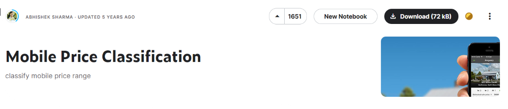

Data yang digunakan dalam proyek ini adalah *dataset* yang diambil dari Kaggle Dataset [Mobile Price Clasification](https://www.kaggle.com/datasets/iabhishekofficial/mobile-price-classification) dengan kategori *dataset*, yaitu *business* dan *clasification*. Dalam *dataset* tersebut terdapat dua *file* atau berkas dengan nama `train.csv` dan `test.cv` yang berekstensi (*file format*) `.csv` atau [comma-separated values](https://en.wikipedia.org/wiki/Comma-separated_values 'Comma-separated values') berukuran 122,4 kB dan 63, 85 kB.

## Variabel-variabel pada Mobile Price Classification

 **Deskripsi Variabel**

   Berikut adalah informasi mengenai variabel-variabel yang terdapat pada *dataset* *Mobile Price Clasification* adalah sebagai berikut.

   | #   | Column         | Non-Null Count | Dtype    |
   |-----|----------------|----------------|----------|
   | 0   | battery_power  | 2000 non-null  | int64    |
   | 1   | blue           | 2000 non-null  | int64    |
   | 2   | clock_speed    | 2000 non-null  | float64  |
   | 3   | dual_sim       | 2000 non-null  | int64    |
   | 4   | fc             | 2000 non-null  | int64    |
   | 5   | four_g         | 2000 non-null  | int64    |
   | 6   | int_memory     | 2000 non-null  | int64    |
   | 7   | m_dep          | 2000 non-null  | float64  |
   | 8   | mobile_wt      | 2000 non-null  | int64    |
   | 9   | n_cores        | 2000 non-null  | int64    |
   | 10  | pc             | 2000 non-null  | int64    |
   | 11  | px_height      | 2000 non-null  | int64    |
   | 12  | px_width       | 2000 non-null  | int64    |
   | 13  | ram            | 2000 non-null  | int64    |
   | 14  | sc_h           | 2000 non-null  | int64    |
   | 15  | sc_w           | 2000 non-null  | int64    |
   | 16  | talk_time      | 2000 non-null  | int64    |
   | 17  | three_g        | 2000 non-null  | int64    |
   | 18  | touch_screen   | 2000 non-null  | int64    |
   | 19  | wifi           | 2000 non-null  | int64    |
   | 20  | price_range    | 2000 non-null  | int64    |

   Dari tabel di atas dapat dilihat bahwa terdapat 2000 baris data dan 21 kolom atribut atau fitur. Di antaranya adalah dua (2) atribut/variabel dengan tipe data `float64 non-null` dan sembilan belas (19) atribut/variabel dengan tipe data `int64 non-null`.

   Berikut adalah keterangan untuk masing-masing variabel.

- `battery_power`: Total energi yang dapat disimpan oleh baterai dalam satu kali pengisian, diukur dalam mAh.
- `blue`: Apakah ponsel memiliki fitur bluetooth atau tidak.
- `clock_speed`: Kecepatan eksekusi instruksi oleh mikroprosesor.
- `dual_sim`: Apakah ponsel mendukung dual SIM atau tidak.
- `fc`: Resolusi kamera depan dalam megapiksel.
- `four_g`: Apakah ponsel mendukung jaringan 4G atau tidak.
- `int_memory`: Memori internal dalam gigabita.
- `m_dep`: Ketebalan ponsel dalam sentimeter.
- `mobile_wt`: Berat ponsel dalam gram.
- `n_cores`: Jumlah inti (cores) pada prosesor.
- `pc`: Resolusi kamera utama dalam megapiksel.
- `px_height`: Tinggi resolusi piksel.
- `px_width`: Lebar resolusi piksel.
- `ram`: Ramdon Acces Memory (RAM) dalam megabyte.
- `sc_h`: Tinggi layar ponsel dalam sentimeter.
- `sc_w`: Lebar layar ponsel dalam sentimeter.
- `talk_time`: Waktu penggunaan ponsel dengan satu kali pengisian baterai.
- `three_g`: Apakah ponsel mendukung jaringan 3G atau tidak.
- `touch_screen`: Apakah ponsel memiliki layar sentuh atau tidak.
- `wifi`: Apakah ponsel memiliki fitur Wi-Fi atau tidak.
- `price_range`: Variabel target yang menunjukkan kisaran harga, dengan nilai 0 (harga rendah), 1 (harga menengah), 2 (harga tinggi), dan 3 (harga sangat tinggi).

2. **Deskripsi Statistik**

   |     Feature  | count | mean     | std      | min  | 25%  | 50%    | 75%    | max    |
   |--------------|-------|----------|----------|------|------|--------|--------|--------|
   | battery_power| 2000.0| 1238.51850| 439.418206| 501.0| 851.75| 1226.0| 1615.25| 1998.0|
   | blue         | 2000.0| 0.49500  | 0.500100  | 0.0  | 0.00  | 0.0   | 1.00   | 1.0    |
   | clock_speed  | 2000.0| 1.52225  | 0.816004  | 0.5  | 0.70  | 1.5   | 2.20   | 3.0    |
   | dual_sim     | 2000.0| 0.50950  | 0.500035  | 0.0  | 0.00  | 1.0   | 1.00   | 1.0    |
   | fc           | 2000.0| 4.30950  | 4.341444  | 0.0  | 1.00  | 3.0   | 7.00   | 19.0   |
   | four_g       | 2000.0| 0.52150  | 0.499662  | 0.0  | 0.00  | 1.0   | 1.00   | 1.0    |
   | int_memory   | 2000.0| 32.04650 | 18.145715 | 2.0  | 16.00 | 32.0  | 48.00  | 64.0   |
   | m_dep        | 2000.0| 0.50175  | 0.288416  | 0.1  | 0.20  | 0.5   | 0.80   | 1.0    |
   | mobile_wt    | 2000.0| 140.24900| 35.399655 | 80.0 | 109.00| 141.0 | 170.00 | 200.0  |
   | n_cores      | 2000.0| 4.52050  | 2.287837  | 1.0  | 3.00  | 4.0   | 7.00   | 8.0    |
   | pc           | 2000.0| 9.91650  | 6.064315  | 0.0  | 5.00  | 10.0  | 15.00  | 20.0   |
   | px_height    | 2000.0| 645.10800| 443.780811| 0.0  | 282.75| 564.0 | 947.25 | 1960.0 |
   | px_width     | 2000.0| 1251.51550| 432.199447| 500.0| 874.75| 1247.0| 1633.00| 1998.0 |
   | ram          | 2000.0| 2124.21300| 1084.732044| 256.0| 1207.50| 2146.5| 3064.50| 3998.0|
   | sc_h         | 2000.0| 12.30650 | 4.213245  | 5.0  | 9.00  | 12.0  | 16.00  | 19.0   |
   | sc_w         | 2000.0| 5.76700  | 4.356398  | 0.0  | 2.00  | 5.0   | 9.00   | 18.0   |
   | talk_time    | 2000.0| 11.01100 | 5.463955  | 2.0  | 6.00  | 11.0  | 16.00  | 20.0   |
   | three_g      | 2000.0| 0.76150  | 0.426273  | 0.0  | 1.00  | 1.0   | 1.00   | 1.0    |
   | touch_screen | 2000.0| 0.50300  | 0.500116  | 0.0  | 0.00  | 1.0   | 1.00   | 1.0    |
   | wifi         | 2000.0| 0.50700  | 0.500076  | 0.0  | 0.00  | 1.0   | 1.00   | 1.0    |
   | price_range  | 2000.0| 1.50000  | 1.118314  | 0.0  | 0.75  | 1.5   | 2.25   | 3.0    |

   Keterangan:

   - count : Jumlah data
   - mean : Rata-rata
   - std : Standar deviasi/simpangan baku
   - min : Nilai minimum
   - 25% : Kuartil bawah/Q1
   - 50% : Kuartil tengah/Q2/median
   - 75% : Kuartil atas/Q3
   - max : Nilai maksimum
  
   catatan:
   Dapat dilihat bahwa sc_width dan px_height memiliki nilai minimum 0, tidak mungkin ada layar ponsel luasnya 0. Nanti perlu menangani ketidaksesuaian ini.

   Untuk lebih mengenali dataset perhatikanlah gambar diagram yang telah diuraikan pada tabel dibawah.

   **Chart 1**

   **Berdasarkan Kategori Harga telepon**
   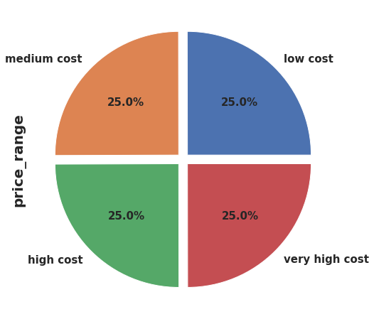

   Gambar 1.

   Tampkak pada Gambar 1 jumlah data pada masing-masing kategori harga baik itu harga Murah, Menengah, Mahal dan Sangat Mahal sama yaitu 500 jumlah data atau masing-masing 25% dari 2000 seperti pada Gambar 1. Dapat dilihat bahwa target variabel terdistribusi secara merata. Sehingga tidak perlu khawatir terhadap *imbalance* data.

   ---

   **Chart 2**

   **Berdasarkan RAM**

   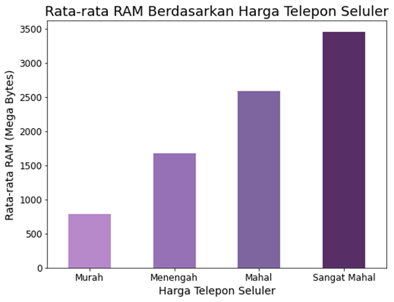

   Gambar 2.

   Rata-rata ukuran *RAM* dibawah 750 *Mega Byte* berada pada kategori harga murah, kategori harga Menengah pada *RAM* 750 an sampai 1750 an *Mega Bytes*, 1750 sampai 2750 an *Mega Byte* untuk kategori Mahal, dan  2750 sampai 3500 *Mega Byte* untuk kategori harga Sangat Mahal dan bisa dilihat kuantitas RAM bertamabah juga akan diikuti harga bertambah. Ini artinya ada korelasi positif yang jelas antara RAM dan price_range. Selain itu juga didapatkan insight bahwasanya banyak pelanggan rela mengeluarkan uang lebih besar untuk mendapatkan RAM yang lebih besar.Artinya bisa saja lebih banyak orang berlomba-lomba jika harga bisa ditekan semestinya ditengah perusahaan yang gencar menaikkan harga pada fitur dikasus yang serupa.

   ---

   **Chart 3**

   **Berdasarkan Baterai**

   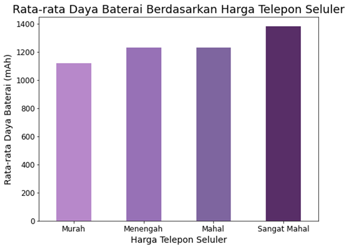

   Gambar 3.

   Tampak pada Gambar 3, grafik memvisualisasikan bagaimana kapasitas baterai, yang diukur dalam mAh, didistribusikan di seluruh dataset. Didapatkan bahwa distribusi kapasitas baterai berkorelasi positif dengan rentang harga ponsel seluler, karena terdapat peningkatan bertahap dalam kapasitas baterai seiring dengan peningkatan rentang harga. Hal ini mengindikasikan bahwa terdapat hubungan kuat antara kapasitas baterai dan harga ponsel seluler, dan bahwa konsumen mungkin bersedia membayar lebih untuk ponsel seluler dengan kapasitas baterai yang lebih tinggi. Hubungan antara kapasitas baterai dan harga ponsel seluler dapat berpotensi menciptakan dampak positif pada bisnis. Jika menjual ponsel seluler dengan kapasitas baterai yang lebih tinggi dengan biaya yang masuk akal atau bahkan sedikit lebih rendah agar dapat menekan harga, mereka mungkin dapat menarik lebih banyak pelanggan lagi.

   ---

   **Chart 4**

   **Berdasarkan Bluetooth**

   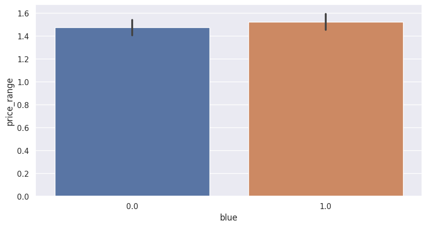

   Gambar 4.

   Tampak pada Gambar 4, grafik menunjukkan hampir separuh perangkat memiliki Bluetooth dan separuhnya tidak.Tidak banyak insight yang bisa ditemukan pada grafik, namun bisa saja menjadi dampak positif jika perusahaan bisa menggunakan informasi ini untuk mengetahui konsumen ikut mempertimbangkan kehadiran bluetooth pada mobile yang akan mereka beli, namun bisa juga menjadi miss informasi jika perusahaan menganggap fitur ini tidak diminati oleh konsumen karena setengah mobile pada dataset tidak memiliki bluetooth.

   **Chart 5**

   **Berdasarkan dual_sim**

   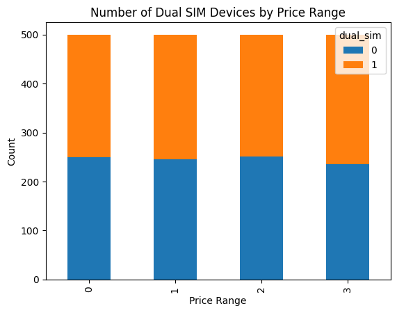

   Gambar 5.

   Didapatkan bahwa dari harga rendah, sedang, tinggi hampir sama tetapi untuk kisaran harga yang sangat tinggi jumlah yang menggunakan `dual_sim` meningkat tampak seperti Gambar 5. Insight yang didapat yaitu

   **Chart 6**

   **Berdasarkan Four_g**

   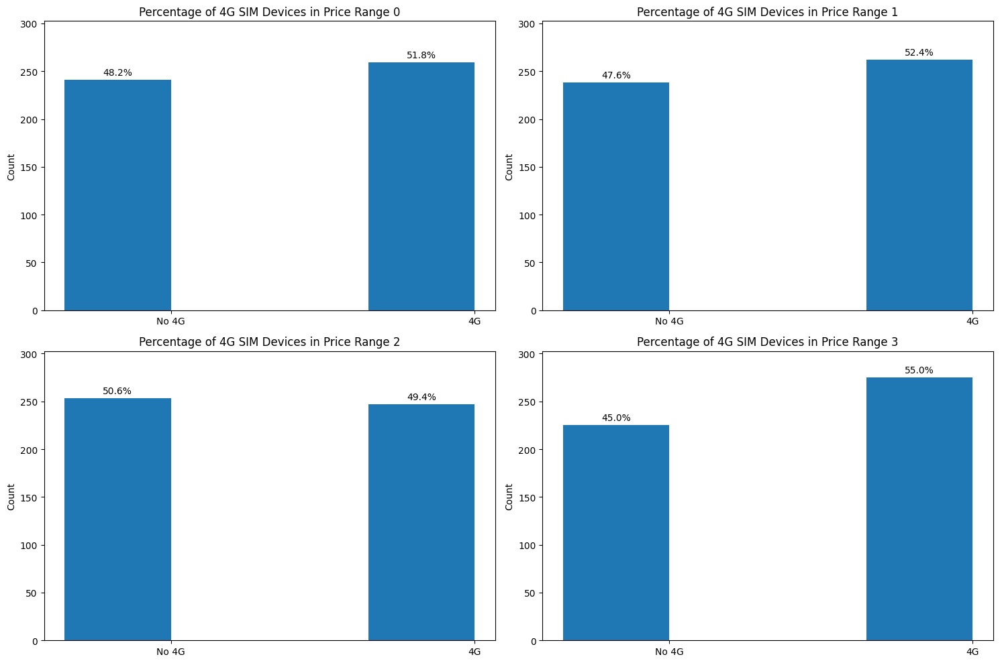

   Gambar 6.

   Demukan bahwa pada rentang harga murah, sedang, dan mahal memiliki jumlah `four_g` yang lebih banyak dibandingkan dengan rentang harga sangat mahal seperti tampak pada Gambar 6. Insight yang diperoleh dari analisis jumlah `four_g` dalam ponsel pada berbagai rentang harga dapat membantu menciptakan dampak positif dalam bisnis. Sebagai contoh, jika sebuah perusahaan ingin memperkenalkan produk baru dalam rentang harga tertentu, mereka dapat menggunakan informasi ini untuk menentukan apakah pasar target mereka lebih suka ponsel dengan satu SIM atau dua SIM, dan menyesuaikan produk mereka sesuai kebutuhan.

   Juga ada penurunan kecil dalam penggunaan kartu SIM pada ponsel dengan harga tinggi mungkin menunjukkan bahwa konsumen pada kisaran harga tersebut lebih mengutamakan fitur-fitur lain daripada memiliki beberapa kartu SIM. Wawasan ini bisa menjadi negatif bagi perusahaan yang fokus utama pada penyediaan ponsel dengan beberapa kartu SIM. Oleh karena itu, perlu bagi perusahaan untuk mempertimbangkan ulang strategi mereka dan mempertimbangkan fitur-fitur lain yang lebih diutamakan oleh konsumen dalam kisaran harga tinggi tersebut.

   **Chart 7**

   **Berdasarkan pixel_width dan pixel_height**

   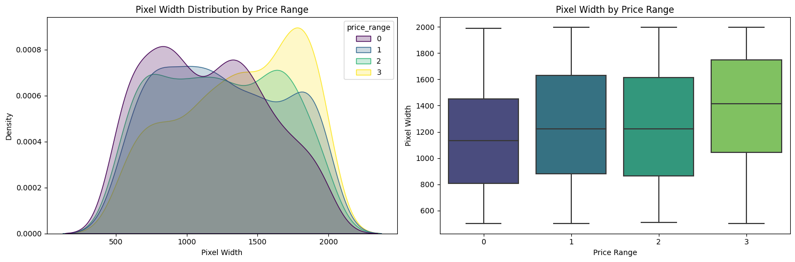

   Gambar 7.

   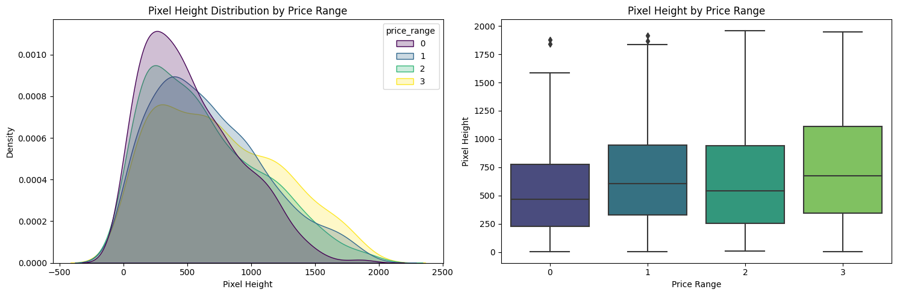

   Gambar 8.

    Tampak pada Gambar 7, dapat diamati bahwa tidak terjadi peningkatan yang kontinu dalam `pixel_width` dari ponsel dengan harga murah ke ponsel dengan harga sangat tinggi. Secara khusus, ponsel dengan harga menengah dan tinggi memiliki `pixel_width` yang hampir sama, menunjukkan bahwa ini mungkin bukan faktor tunggal dalam menentukan rentang harga ponsel. Fitur-fitur lain seperti prosesor, kualitas kamera, kapasitas penyimpanan, dan nilai merek juga dapat memainkan peran yang signifikan dalam menentukan rentang harga. Oleh karena itu, pendekatan holistik yang mempertimbangkan berbagai faktor diperlukan untuk penetapan harga dan penempatan yang akurat bagi ponsel di pasar. Begitu juga dengan `pixel_height` tampak pada Gambar 8 hampir sama ketika dari harga murah hingga harga sangat tinggi, dengan sedikit variasi dalam tinggi piksel. Namun walaupun demikian, sejalan `pixel_weidth` bertambah `price_range` juga ikut bertambah. Artinya

   **Chart 8**

   **Berdasarkan Dual SIM**

   |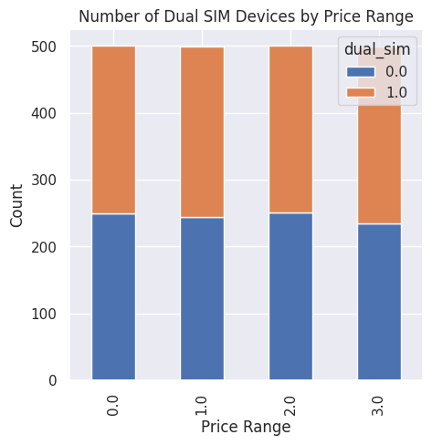

   Gambar 9.

   Tampak pada Gambar 9, hubungan antara harga perangkat dan penggunaan dual SIM menunjukkan bahwa pada kisaran harga rendah, menengah, dan tinggi, penggunaan dual SIM seimbang. Namun, pada harga sangat tinggi, penggunaan dual SIM meningkat secara signifikan. Temuan ini memiliki dampak positif, membantu bisnis memahami preferensi pengguna terhadap dual SIM untuk mengoptimalkan pemasaran dan pengembangan produk. Namun, ada potensi dampak negatif, yaitu penurunan penjualan perangkat tanpa dual SIM pada harga tinggi, karena pengguna lebih suka fitur tambahan.

   **Chart 9**

  **Berdasarkan FC (front camera megapixels)**

  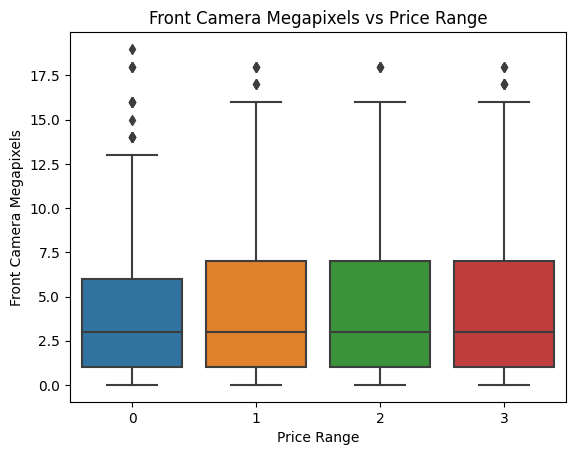

  Gambar 10.

  Kisaran harga hampir sama di semua kategori, seperti tampak pada Gambar 10.Pengamatan bahwa distribusi megapiksel kamera depan serupa di semua rentang harga menunjukkan bahwa fitur ini sendiri mungkin bukan prediktor yang membantu dalam menentukan harga. Namun, ini tidak berarti bahwa wawasan yang diperoleh dari analisis ini tidak dapat memberikan dampak positif pada bisnis.

   Sebagai contoh, memahami batasan-batasan tertentu dalam fitur-fitur tertentu untuk memprediksi rentang harga dapat membantu dalam pengembangan model yang lebih akurat yang mempertimbangkan beberapa fitur secara bersamaan. Hal ini dapat mengarah pada strategi penetapan harga yang lebih baik dan penempatan produk yang lebih efektif, akhirnya menghasilkan peningkatan pendapatan dan pertumbuhan.

   Di sisi lain, jika sebuah perusahaan hanya mengandalkan megapiksel kamera depan untuk menentukan harga, hal ini bisa menyebabkan pertumbuhan yang negatif jika pesaing menawarkan fitur-fitur yang lebih canggih yang lebih dihargai oleh pelanggan. Oleh karena itu, penting bagi bisnis untuk mempertimbangkan beberapa faktor dan tetap up-to-date dengan preferensi pelanggan yang berkembang dan kemajuan teknologi agar tetap kompetitif pada kisaran harga di pasar.

   **Chart 10**

   **Berdasarkan mobile weight**

   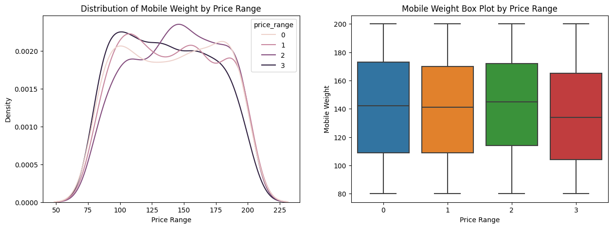

   Gambar 11.

   Tampak pada Gambar 11, dapat diamati bahwa ponsel dengan kisaran harga yang lebih tinggi cenderung memiliki bobot yang lebih ringan dibandingkan ponsel dengan kisaran harga yang lebih rendah. Ini artinya fitur ini memiliki korelasi yang positif terhadap *price_range*, sehingga menjadi salah satu faktor pendorong dalam menentukan kategori target.

   **Chart 11**

   **Berdasarkan screen_size**

   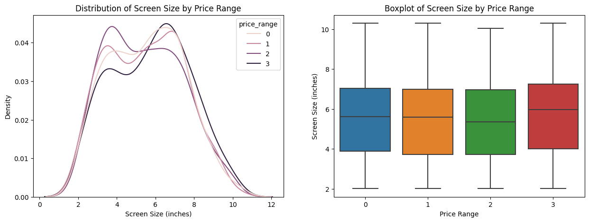

   Gambar 12.

   Tampak pada Gambar 12, bahwa tidak ada perbedaan distribusi yang signifikan, sehingga menunjukkan bahwa ukuran layar mungkin bukan satu-satunya faktor pendorong dalam menentukan kategori target. Namun, keseragaman distribusi ini dapat bermanfaat untuk pemodelan prediktif, karena hal ini menyiratkan bahwa Ukuran Layar mungkin bukan variabel yang signifikan dalam membedakan kategori target yang berbeda, sehingga fitur lain dapat memainkan peran yang lebih penting dalam menentukan kategori target.

   **Chart 12**

   **Berdasarkan Three_g**

   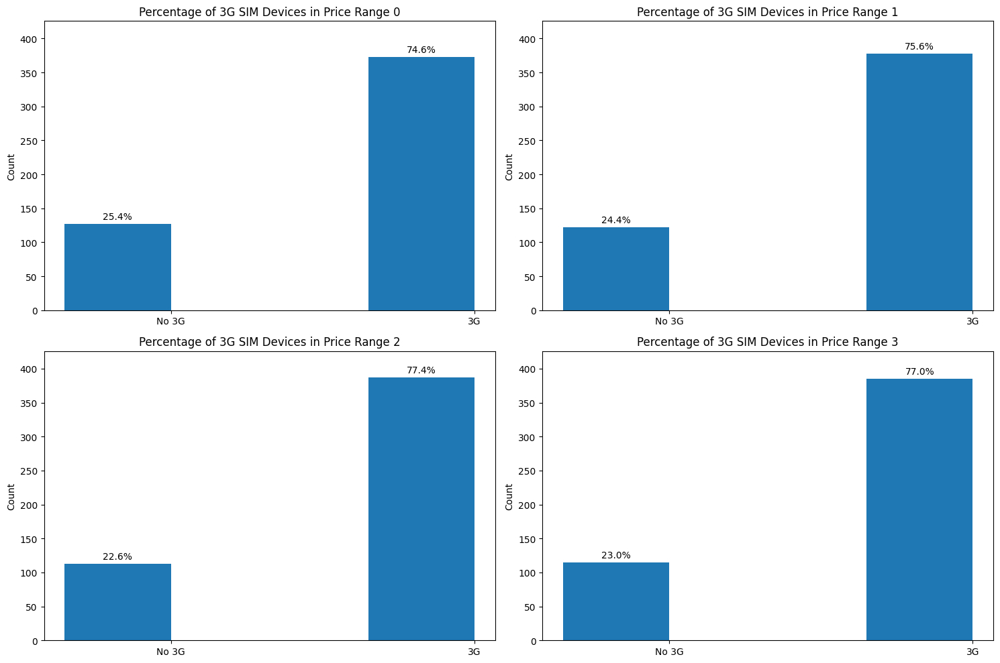

   Gambar 13.

   Tampak pada Gambar 13, bahwa sim *Three_g* banyak muncul pada semua kisaran harga.Ini dapat berpotensi memberikan dampak positif pada bisnis yang memproduksi atau menjual perangkat seluler. Ini menunjukkan bahwa konsumen masih menghargai ketersediaan koneksi 3G dalam perangkat seluler mereka, meskipun jaringan 4G semakin tersedia. Hal ini dapat memengaruhi keputusan bisnis seperti terus memproduksi dan memasarkan perangkat dengan konektivitas 3G, atau menyesuaikan strategi penetapan harga untuk mencerminkan permintaan berkelanjutan terhadap perangkat tersebut.

   Sementara itu, dalam hal yang negatif, wawasan ini tidak menunjukkan faktor-faktor yang jelas yang akan menyebabkan pertumbuhan yang negatif. Namun, penting untuk mempertimbangkan pasar secara lebih luas dan lanskap persaingan ketika membuat keputusan bisnis, karena faktor-faktor lain seperti pesaing baru atau perubahan preferensi konsumen masih dapat memiliki dampak negatif.

   **Chart 13**

   **Berdasarkan Wifi**

   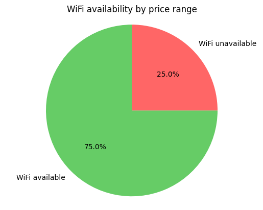

   Gambar 14.

   Tampak pada Gambar 14, sekitar 25% wifi tidak tersedia dan 75% wifi tersedia. Dari visualisasi tersebut dapat berdampak  positif yaitu memberikan informasi tentang ketersediaan WiFi dalam kisaran harga yang berbeda. Misalnya, jika analisis menunjukkan bahwa WiFi tidak tersedia dalam kisaran harga tertentu, perusahaan dapat fokus menambahkan WiFi ke perangkatnya dalam kisaran harga tersebut untuk meningkatkan daya saingnya. Namun, jika analisis menunjukkan bahwa WiFi tidak tersedia di sebagian besar rentang harga, hal ini dapat menyebabkan pertumbuhan negatif jika pelanggan menganggap WiFi sebagai fitur yang diperlukan dan memilih perangkat pesaing dibandingkan perangkat tanpa WiFi. Penting untuk mempertimbangkan permintaan pasar dan preferensi pelanggan sebelum mengambil keputusan bisnis berdasarkan wawasan yang diperoleh dari visualisasi.

# Data Preparation

 Berdasarkan penjelasan dan pengamatan pada *Data Understanding* tiap kategori pada data seimbang, terdistribusi dengan baik artinya tidak perlu melakukan  *data imbalance*, *oversampling* atau *undersampling* untuk **standardisasi* data.

**Mengatasi missmatch**

 Berdasarkan penjelasan pada *Data Understanding* terdapat ketidakcocokan data pada `sc_width` and `px_height` yang minimum valuenya 0. Sehingga didrop, namun karena baru melakukan drop data,  harus dilakukan pencegahan missing value. Menggunakan algoritma `Nearest Neighbors Imputations (KNNImputer)`, untuk menentukan nilai yang paling sesuai menggantikan nilai yang hilang tersebut.

KNNImputer bekerja dengan mengidentifikasi tetangga terdekat dari setiap titik data yang memiliki nilai hilang dan kemudian mengambil nilai yang ada dari tetangga terdekat tersebut. Kemudian, KNNImputer menggunakan nilai-nilai yang diperoleh dari tetangga terdekat tersebut untuk menggantikan nilai yang hilang dalam dataset.

**Missing Value**

Dengan menggunakan fungsi `sum()` pada dataset yang nilainya null atau `df.isnull()`. Hasilnya tidak terdapat missing value, seperti tampak pada tabel Mis_val dibawah.

   Tabel Mis_val

   | Fitur           | Banyak Missing value |
   |-----------------|-------|
   | battery_power   | 0     |
   | blue            | 0     |
   | clock_speed     | 0     |
   | dual_sim        | 0     |
   | fc              | 0     |
   | four_g          | 0     |
   | int_memory      | 0     |
   | m_dep           | 0     |
   | mobile_wt       | 0     |
   | n_cores         | 0     |
   | pc              | 0     |
   | px_height       | 0     |
   | px_width        | 0     |
   | ram             | 0     |
   | sc_h            | 0     |
   | sc_w            | 0     |
   | talk_time       | 0     |
   | three_g         | 0     |
   | touch_screen    | 0     |
   | wifi            | 0     |
   | price_range     | 0     |
   | sc_size         | 0     |

**Mengatasi outliers**

Berdasarkan penjelasan pada *Data Understanding* terdapat outliers pada fitur `front camera` dan `pixel height`.
Sehingga perlu dilakukan proses pembersihan *outliers* dengan metode IQR (*Inter Quartile Range*).

$$IQR=Q_3-Q_1$$

Kemudian membuat batas bawah dan batas atas untuk mencakup *outliers* dengan menggunakan:

$$BatasBawah=Q_1-1.5*IQR$$

$$BatasAtas=Q_3-1.5*IQR$$

Setelah dilakukan pembersihan `outliers`, dilakukan kembali visualisasi `outliers` untuk melakukan pengecekan kembali sebagai berikut:

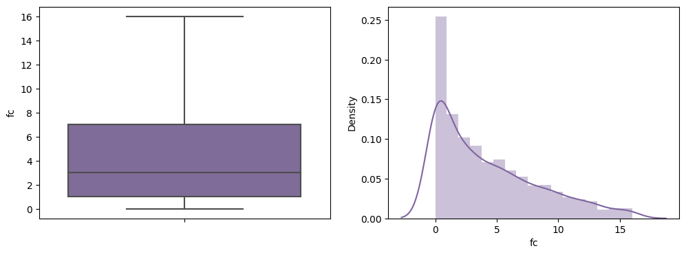
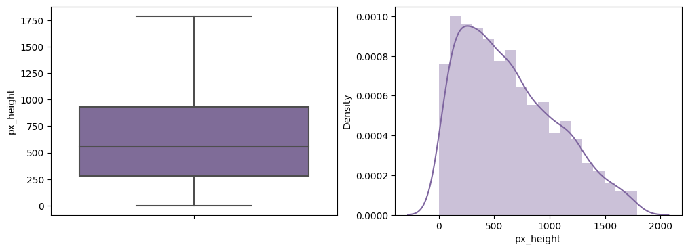

**Categorical Encoding**

Tidak perlu dilakukan *categorical encoding* karena semua nilai sudah dalam *integer* atau *float*.

**Data Transformation**

Dilakukan Data transformation untuk menghindari ovevitting, yaitu membuang `px_height` dan `px_width` menghapus feature tersebut karena tidak berguna.

**Data Scaling**

Dengan menggunakan *MinMaxScaler* dari *Scikit-learn* digunakan untuk mengubah skala data dalam variabel X. Proses ini mengubah nilai data sehingga berada dalam rentang biasanya antara 0 dan 1. Ini dilakukan dengan mengurangkan nilai minimum dari setiap titik data dan kemudian membaginya dengan jangkauan (perbedaan antara nilai maksimum dan minimum).

Menggunakan *MinMaxScaler* karena fungsi tersebut merupakan metode yang umum dipakai dalam Machine Learning, terutama ketika distribusi data tidak diketahui atau tidak normal. Metode ini juga berguna ketika terdapat outlier dalam data karena lebih tahan terhadap pengaruh outlier dibandingkan metode lain.

**Data Splitting**

Data di **split** dengan rasio 75:25 untuk set *train* dan *test*. Ini berarti bahwa 75% dari data akan digunakan untuk melatih model, dan 25% dari data akan digunakan untuk menguji kinerja model.

Pembagian data dengan rasio ini adalah pembagian umum yang digunakan dalam *machine learning*, di mana proporsi yang lebih besar dari data digunakan untuk pelatihan agar model memiliki cukup data untuk belajar. Proporsi yang lebih kecil dari data  dialokasikan untuk pengujian digunakan untuk mengevaluasi kinerja model pada data yang belum pernah dilihat sebelumnya, yang membantu dalam menilai sejauh mana model dapat menggeneralisasi ke data baru.

Parameter *random_state* nilainya 1, yaitu benar diacak untuk memastikan bahwa pembagian data dilakukan secara reproduktif. Nilai state acak yang sama juga digunakan pada berbagai eksekusi kode untuk memastikan bahwa titik data yang sama diberikan baik itu set *train* dan set *test* setiap kali kode dijalankan. Ini akan membantu menjaga konsistensi dalam hasil pengujian model.

**Feature Enginering**

Dilakukan Feature Enginering untuk melihat urutan besar kontribusi setiap fiturnya. Berikut hasilnya:

|     Specs      |        Score        |
|:--------------:|:-------------------:|
|    ram         |   914971.362532     |
|  px_height     |   15629.508974      |
|  battery_power |   13276.863289      |
|   px_width     |    9172.791036      |
|  mobile_wt     |      87.027556      |
|  int_memory    |      78.357703      |
|     sc_h       |      11.815783      |
|   talk_time    |      11.460771      |
|     sc_w       |      11.079469      |
|      fc        |      10.867193      |
|    n_cores     |       8.395937      |
|      pc        |       7.639203      |

## Modeling

Feature yang dipilih yaitu  12 besar fitur dengan `feature score` tertinggi yang dipilih melalui tahap `Feature Selection` menggunakan *library* *SelectKBest* dari *sklearn.feature_selection* antara lain :

- `ram`
- `px_height`
- `battery_power`
- `px_width`
- `mobile_wt`
- `int_memory`
- `sc_h`
- `talk_time`
- `sc_w`
- `fc`
- `n_cores`
- `pc`

Target yang dipilih:

- `Rentang Harga`

Algoritma yang digunakan:

1 **Decision Tree**

   Pada model ini tidak dilakukan *Feature Scalling* karena algoritma ini adalah *tree based model*, sehingga menggunakan *X_train, X_test, y_test* dan *Y_train* yang tidak diskalakan, selain itu juga karena algoritma ini tidak sensitif terhadap perbedaan data. Hal ini juga dilakukan pada algoritma *tree based model* lain, seperti *Random Forest Classifier*, *Gradient Boosting Classifier*, dan *XG Boost Classifier*  sementara untuk *distance based model* seperti *K-nearest Neighbour Classifier* dan *Support Vector Machine (SVM)* akan menggunakan *X_train_scaled* and *X_test_scaled* yang telah dilakukan *scaling*.

   Pada model ini menggunakan default *hyperparameters* dan untuk mengurangi *overvitting* dilakukan *tuning hyperparameters*.

   Pertama  default *hyperparameters* menggunakan parameter `random_state` dengan nilai 0, metrik yang digunakan yaitu `confusion_matrix` ,*accuracy f1-score* digunakan sebagai metrik evaluasi untuk memilih model karena data sudah terdistribusi dengan baik.

   Kedua menggunakan *tuning hyperparameters* berparameter `criterion` dengan nilai `entropy`, `max_depth` dengan nilai `9`, `min_samples_split` dengan nilai `10`, dan `random_state` dengan nilai `0`. Parameter tersebut dipilih menggunakan `GridSearchCv` dari pilihan paramameter *grid values* yang telah dibuat. Metrik evaluasi yang digunakan yaitu *accuracy recall*.

2 **Random Forest classifier**

   Model ini menggunakan *X_train, X_test, y_test* dan *Y_train* yang tidak diskalakan sama halnya pada *tree based modal yang lain*.Pada model ini menggunakan *default hyperparameters* dan untuk mengurangi *overvitting* dilakukan *tuning hyperparameters*.

   Pertama menggunakan default *hyperparameters* parameter yang digunakan `random_state`dengan nilai 0. Metrik evaluasi yang digunakan yaitu *accuracy f1-score*.

   Kedua menggunakan *tuning hyperparameters* parameter yang digunakan yaitu `criterion` dengan nilai `entropy`, `max_features` dengan nilai `auto`, `min_samples_split` dengan nilai 6, `n_estimators` dengan nilai 700, dan `random_state` dengan nilai 0. Parameter-parameter tersebut dipilih menggunakan `GridSearchCv` dari pilihan paramameter *grid values* yang telah dibuat. Metrik evaluasi yang digunakan yaitu *accuracy recall*.

3 **Gradient Boosting Classifier**

   Model ini menggunakan *X_train, X_test, y_test* dan *Y_train* yang tidak diskalakan sama halnya pada *tree based modal yang lain*. Pada model ini menggunakan *default hyperparameters* dan untuk mengurangi *overvitting* dilakukan *tuning hyperparameters*.

   Pertama menggunakan default *hyperparameters* parameter yang digunakan `random_state`dengan nilai 0. Metrik evaluasi yang digunakan yaitu *accuracy f1-score*.

   Kedua menggunakan *tuning hyperparameters* parameter yang digunakan yaitu `learning_rate` dengan nilai 1, `min_samples_split` dengan nilai 25, dan `random_state dengan` nilai 0. Parameter-parameter tersebut dipilih menggunakan `GridSearchCv` dari pilihan paramameter *grid values* yang telah dibuat. Metrik evaluasi yang digunakan yaitu *accuracy recall*.

4 **K-nearest Neighbour classifier**

   Split train dan test menggunakan *X_train_scaled* and *X_test_scaled* yang telah dilakukan *scaling*.Pada model ini menggunakan *default hyperparameters* dan untuk mengurangi *overvitting* dilakukan *tuning hyperparameters*.

   Pertama menggunakan default *hyperparameters* tanpa menggunakan parameter. Menggunakan *accuracy f1-score* sebagai metrik evaluasi.

   Kedua menggunakan *tuning hyperparameters* parameter yang digunakan yaitu `n_neighbors` dengan nilai 29. Parameter-parameter tersebut dipilih menggunakan `GridSearchCv` dari pilihan paramameter *grid values* yang telah dibuat. Metrik evaluasi yang digunakan yaitu *accuracy recall*.

5 **XG Boost Classifier**

   Model ini menggunakan *X_train, X_test, y_test* dan *Y_train* yang tidak diskalakan sama halnya pada *tree based modal yang lain*. Pada model ini juga menggunakan *default hyperparameters* dan untuk mengurangi *overvitting* dilakukan *tuning hyperparameters*.

   Pertama menggunakan default *hyperparameters* tanpa menggunakan parameter. Menggunakan *accuracy f1-score* sebagai metrik evaluasi.

   Kedua menggunakan *tuning hyperparameters* parameter yang digunakan yaitu `learning_rate` dengan nilai 0.6, `gamma` dengan nilai 0.2, `n_estimators` dengan nilai 1000, dan `subsample` dengan nilai 0.5.
   Parameter-parameter tersebut dipilih menggunakan `GridSearchCv` dari pilihan paramameter *grid values* yang telah dibuat. Metrik evaluasi yang digunakan yaitu *accuracy recall*.

6 **Support Vector Machine(SVM)**

   Split train dan test menggunakan *X_train_scaled* and *X_test_scaled* yang telah dilakukan *scaling*.Pada model ini menggunakan *default hyperparameters* dan untuk mengurangi *overvitting* dilakukan *tuning hyperparameters*.

   Pertama menggunakan default *hyperparameters* parameter yang digunakan `random_state` dengan nilai 1. Menggunakan *accuracy f1-score* sebagai metrik evaluasi.

   Kedua menggunakan *tuning hyperparameters* parameter yang digunakan `C` dengan nilai 10, `degree` dengan nilai 1, `gamma` dengan nilai 0.01, `kernel` dengan nilai 'linear', dan `probability` dengan nilai True. Parameter-parameter tersebut dipilih menggunakan `GridSearchCv` dari pilihan paramameter *grid values* yang telah dibuat. Metrik evaluasi yang digunakan yaitu *accuracy recall*.

## Evaluation

Pada keenam algoritma tersebut dibandingkan dan dievaluasi berdasarkan overall accuracy score dan recall pada masing-masing kelas. Akurasi merupakan perbandingan antara data yang terklasifikasi benar dengan keseluruhan data. Nilai akurasi dapat diperoleh dengan persamaan berikut :
  
Berikut tabel evaluasi:

| Kolom 1                          | Training set accuraccy|  Training set recall | Test set accuraccy | Test set recall |
|----------------------------------|:--------:|:--------:|:--------:|:--------:|
| Decision Tree                    |  100%        |   100%       |    85%      |       84%   |
| Decision Tree (Hyperparameter Tuning) |  97.62%        |   97.5%      |  83.13%        |     82.75%     |
| Random Forest                    |     100%     |     100%     |     88.6%     |      88.5%    |
| Random Forest (Hyperparameter Tuning) |   100%       |   100%      |    89.81%      |       89.5%   |
| Gradient Boosting                |    100%      |   100%       |    90.02%      |   90%       |
| Gradient Boosting (Hyperparameter Tuning) |     100%     |   100%       |    90.42%      |    90.05%      |
| KNN                              |    70.75%      |  70.46%        |    52%      |    51.75%      |
| KNN (Hyperparameter Tuning)      |    68%      |    68.75%      |     59%    |     58.75%     |
| XG-Boost                         |   98.98%      |    98.75%      |     89%     |    90%      |
| XG-Boost (Hyperparameter Tuning) |     100%     |     100%     |      91%    |    92.25%      |
| SVM                              |     98.75%     |    98.5%      |      88%    |    89.75%      |
| SVM (Hyperparameter Tuning)      |     98.3%     |      98.5%    |      97%    |    98%      |

  Berdasarkan akurasi seperti tabel diatas dapat dipilih model:

- Model terbaik adalah SVM (Hyperparameter Tuning), yaitu dengan akurasi score tertinggi dan tidak overvitting
- XG-Boost (Hyperparameter Tuning) adalah model terbaik kedua,setelah dilakukan tuning hyperparameters namun walaupun dengan akurasi skor tertinggi model ini overvitting.
- KNN merupakan model terburuk
- Fitur yang signifikan mempengaruhi kisaran harga ponsel yaitu RAM, Battery power, Px_height, dan Px_width

## References

[1] chickencola. (2023). Underfitting and Overfitting. Kaggle. <https://www.kaggle.com/code/chickencola/underfitting-and-overfitting>

[2] Widyanto dan Toro, J. S., Analysis of Influence of Service Quality and Price on Fairness with Costumers
Satisfaction Customer Loyalty, Corporate Image and Variable Trust as Meditation: Studies in Consumer
PO. Surakarta. Fokus Journal, 11 (2), 2012, 195-212.

[3] Blackwell, RD, Miniard, PW & Engel, JF (2006). Consumer behavior, 10th edn, Thomson SouthWestern, Boston.

[4] [DTree Lecture Notes]. (2023). Diakses dari <https://www.cis.upenn.edu/~danroth/Teaching/CS446-17/LectureNotesNew/dtree/main.pdf>
